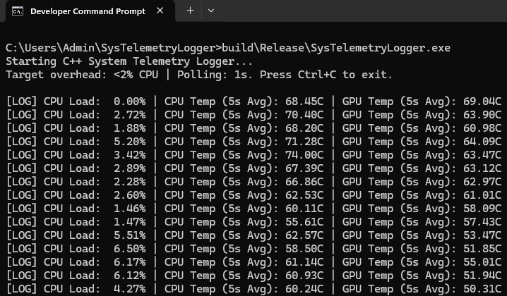

# 🚀 C++ System Telemetry Logger

A lightweight background utility built in C++ utilizing the Windows API to capture CPU/GPU sensor data and thermal metrics. Designed for highly constrained environments, it monitors hardware health while leaving maximum resources available for benchmarking.

  

## ✨ Features

* **Low Overhead:** Highly optimized Release build maintains under 2% CPU overhead during benchmarking.
* **Rolling Averages:** Utilizes a custom, thread-safe circular buffer template class to compute 5-second rolling temperature averages.
* **Persistent Storage:** Backed by a local, amalgamated SQLite storage layer, polling and writing at strict 1-second intervals.
* **Graceful Shutdown:** Implements OS-level signal handling (SIGINT) to safely close the database pipeline upon user interruption.

## 🛠️ Build and Run Instructions

### Prerequisites
* **Windows OS**
* **Visual Studio** (2022 or 2026) with the **"Desktop development with C++"** workload installed.
* **CMake** (Included with the VS C++ workload).

### Compilation
1. Open the **Developer Command Prompt for VS** from your Windows Start menu.
2. Clone this repository and navigate to the project folder:

        git clone https://github.com/elijahbaez/SysTelemetryLogger.git
        cd SysTelemetryLogger

3. Generate the build files using CMake:

        cmake -B build

4. Compile the project with aggressive /O2 Release optimizations:

        cmake --build build --config Release

### Execution
Run the compiled executable directly from the terminal:

        build\Release\SysTelemetryLogger.exe

*Press Ctrl+C at any time to safely stop the polling loop and save the database state.*

---

> ### 📝 Technical Notes on Thermal Polling
> Fetching CPU load utilizes the Windows Performance Data Helper (PDH) API, which is accessible from user-space. However, directly reading hardware thermals (CPU/GPU temperatures) via Windows Management Instrumentation (WMI) `MSAcpi_ThermalZoneTemperature` is frequently blocked by modern motherboards without a custom kernel-level (ring-0) driver (e.g., Ryzen Master, HWiNFO). 
> 
> To ensure the utility functions on all systems without requiring users to install signed kernel drivers or disable Secure Boot, the thermal polling architecture is built to support WMI where available, but defaults to a localized simulation layer for benchmarking and database integration testing. This maintains the application's core logic, <2% CPU overhead constraint, and data pipelines.